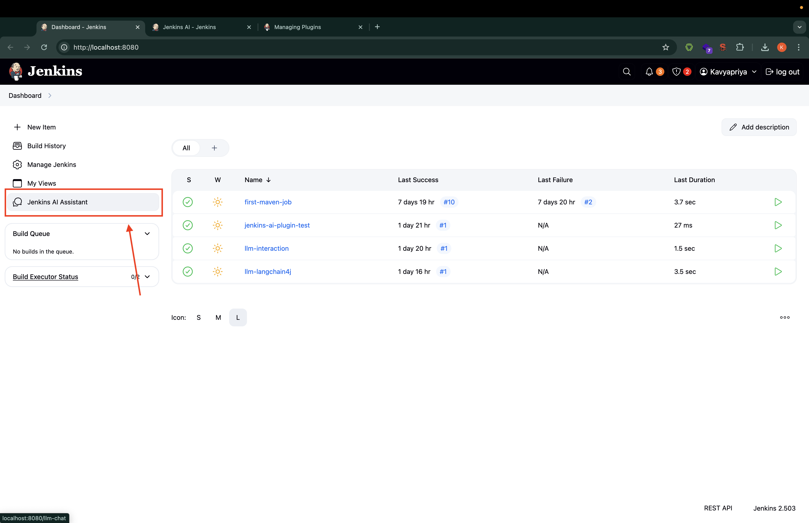
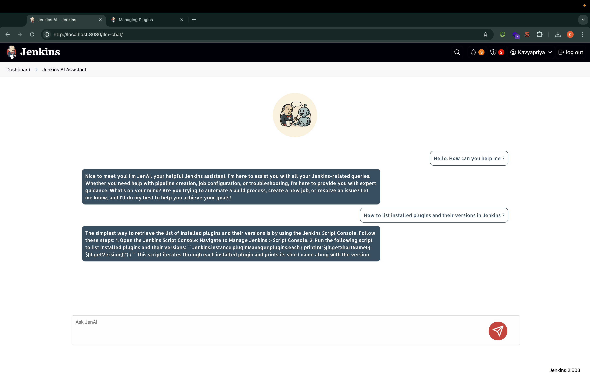

# JenAI: Jenkins AI Assistant Plugin

## Introduction

JenAI integrates an AI-powered assistant directly into your Jenkins interface. Ask questions about Jenkins, your projects, or general development topics. It utilizes Retrieval-Augmented Generation (RAG) to provide contextually relevant answers based on ingested documentation (currently requires manual ingestion setup).

This plugin leverages:
*   **LLMs:** Currently configured for Groq (using the Llama3 model via its OpenAI-compatible API).
*   **Embedding Models:** Hugging Face's `sentence-transformers/all-MiniLM-L6-v2`.
*   **Vector Store:** MongoDB Atlas for storing and retrieving document embeddings for RAG.
*   **Framework:** Langchain4j.

## Features

*   **Chat Interface:** Access "JenAI" via a dedicated page in Jenkins.
*   **Retrieval-Augmented Generation (RAG):** Answers questions based on data ingested into a MongoDB Atlas vector store.
*   **Configurable API Keys:** Uses Jenkins global environment variables for secure API key management.

## Getting Started

### Prerequisites

1.  **Groq Account:** Sign up for GroqCloud (https://console.groq.com/) and generate an API key.
2.  **Hugging Face Account:** Sign up for Hugging Face (https://huggingface.co/) and create an Access Token (API Key).
3.  **MongoDB Atlas Account:**
    *   Create a MongoDB Atlas cluster (https://cloud.mongodb.com/).
    *   Obtain the connection string (SRV address recommended).
    *   Create a database (e.g., `jenkins_ai_plugin`) and a collection (e.g., `webpage_embeddings`) within that database.
    *   **Crucially:** Create an **Atlas Vector Search Index** on your collection (`webpage_embeddings`).
        *   **Index Name:** `vector_index` (This exact name is expected by the current implementation).
        *   **Field:** `embedding`
        *   **Dimensions:** `384` (to match the `all-MiniLM-L6-v2` model).
        *   **Similarity:** `cosine`
        *   Refer to the [MongoDB Atlas Vector Search documentation](https://www.mongodb.com/docs/atlas/atlas-vector-search/create-index/) for detailed instructions. This index is *required* for the RAG functionality.

### Installation
Currently, its not published to Jenkins repo. However, you can spin up Jenkins in local and Add the `target/jenkins-ai-plugin.hpi` to the Jenkins instance following [Configure custom plugin](https://www.jenkins.io/doc/book/managing/plugins/)

1. run `mvn spotless:apply`
2. run `mvn clean install -DskipTests`
3. Install the plugin via the Jenkins Plugin Manager (Search for "JenAI"). 
4. Restart Jenkins if required.


### Configuration

Configure the necessary API keys and connection string as Jenkins global environment variables:

1.  Navigate to `Manage Jenkins` -> `System` -> `Global properties` -> `Environment variables`
2.  Add the following environment variables:
    *   `GROQ_API_KEY`: Your API key from GroqCloud.
    *   `HF_API_KEY`: Your Access Token from Hugging Face.


### Data Ingestion (Required for RAG)

**Important:** Currently, the plugin requires data (like Jenkins documentation web pages) to be *manually ingested* into the MongoDB Atlas collection before the RAG feature can answer questions based on that content.

The project includes utility classes (`Ingestor.java`, `URLIngestor.java`) that can be run locally by a developer to ingest data from specific URLs. A user-friendly data ingestion mechanism (e.g., a Jenkins job type or UI configuration) is planned for future releases.

To ingest data manually (developer instructions):
1. Clone the plugin repository.
2. Ensure you have the necessary environment variables (`GROQ_API_KEY`, `HF_API_KEY`) set in your local development environment (e.g., via a `.env` file or system environment variables).
3. Modify and run the `main` method in `src/main/java/io/jenkins/plugins/rag/Ingestor.java` to point to the URLs you want to ingest.

```java
// Example in Ingestor.java main method
public static void main(String[] args) {
    try {
        // Add the URLs you want to ingest
        String url1 = "https://www.jenkins.io/doc/book/managing/plugins/";
        String url2 = "https://www.jenkins.io/doc/book/pipeline/syntax/";
        // ... add more URLs

        runIngestionPipeline(url1);
        runIngestionPipeline(url2);
        // ... call for other URLs

        System.out.println("Ingestion complete.");
    } catch (Exception e) {
        throw new RuntimeException(e);
    }
}
```

## User Interface screenshots

### Dashboard UI


### Chat UI
